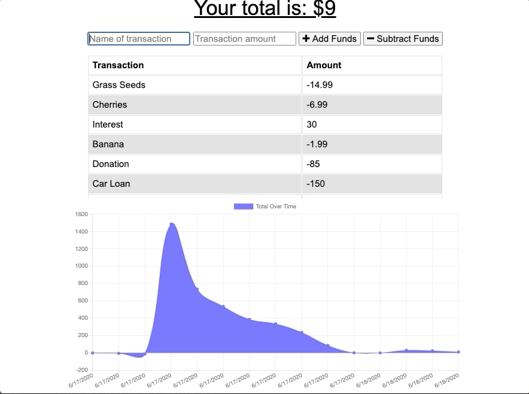

# Budget Tracker (PWA)

   

## Description

Budget Tracker is a Progessive Web Application (PWA) that allows for simple online and offline access and budgeting functionality. The user is able to add expenses and deposits to their budget with or without an internet connection. When entering transactions offline, the transactions and total are displayed and functional. When online the transaction data is populated in the database. The application is also downloadable as a desktop application or a mobile application on a smartphone.

**Deployed App:** 

[https://the-budget-tracker-app.herokuapp.com/](https://the-budget-tracker-app.herokuapp.com/)

**Tech Stack:** 

    HTML / CSS / JavaScript / Node.js / Express / Mongoose / MongoDB / IndexedDB / Webpack / Manifest.json 

## Usage

#### Basic Functionality

#### Offline Functionality

#### Installing as a desktop app (PWA)

#### Installed app

## Installation

#### Requirement
Prior installation of the following technologies are required.

    - Node.js
    - Mongo DB
    - Latest browser version for Chrome / Firefox / Safari / Edge etc.

#### Dependencies
The following dependencies are installed when you run `npm install`

    - Express
    - Mongoose
    - Morgan
    - compression
    - body-parser

## License

Licensed under the [MIT](https://choosealicense.com/licenses/mit/) license.